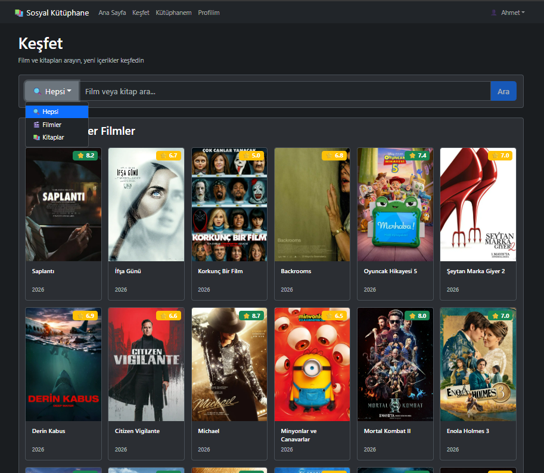

# 📚 Social Library - Sosyal Kitap & İnceleme Platformu

Social Library, kitapseverlerin okudukları kitapları ve izledikleri filmleri takip edebilecekleri, incelemeler (review) yazıp puanlayabilecekleri ve diğer kullanıcılarla etkileşime girebilecekleri modern bir sosyal kütüphane platformudur. 

Proje, backend tarafında **C# ASP.NET Core Clean Architecture**, frontend tarafında ise **React (Vite) & Bootstrap** mimarisi kullanılarak modern yazılım prensiplerine uygun şekilde geliştirilmiştir.

---

## 📸 Proje Ekran Görüntüleri

> [!NOTE]
> Proje görselleri yakında eklenecektir. Görsel dosyalarınızı `./assets/screenshots/` dizinine yerleştirerek aşağıdaki yer tutucuları aktif hale getirebilirsiniz.

### 🖥️ Genel Görünüm ve Ana Sayfa
<!-- Buraya ana sayfa veya dashboard görselini yerleştirebilirsiniz -->


### 🔍 Kitap Arama & Sosyal Akış
<!-- Buraya arama veya akış (feed) ekranı görselini yerleştirebilirsiniz -->


### 👤 Kullanıcı Profili & İncelemeler
<!-- Buraya kullanıcı profili ve kitap detay/yorum ekranı görselini yerleştirebilirsiniz -->


---

## 🚀 Özellikler

*   **Clean Architecture (Modüler Mimari):** Domain, Application, Infrastructure ve API katmanlarından oluşan, gevşek bağlı (loosely-coupled) ve test edilebilir kod yapısı.
*   **Sosyal Etkileşim:** Kitapları puanlama, detaylı incelemeler yazma ve diğer kullanıcıların okuma aktivitelerini takip etme.
*   **Gelişmiş Filtreleme:** Türlerine, puanlarına veya isimlerine göre dinamik kitap arama ve listeleme.
*   **Kullanıcı Yönetimi:** JWT (JSON Web Token) tabanlı güvenli kimlik doğrulama, kullanıcı profili güncelleme ve kişiselleştirilmiş okuma listeleri.
*   **Karanlık Mod Desteği:** Kullanıcı göz sağlığı için varsayılan olarak aktifleşen modern koyu tema arayüzü.
*   **Docker & Bulut Entegrasyonu:** PostgreSQL bulut veritabanı (Neon) entegrasyonu, Hugging Face Spaces üzerinde Dockerized API dağıtımı ve Vercel frontend barındırma.

---

## 🛠️ Teknoloji Yığını

### Backend
*   **Dil & Framework:** C# 12 / .NET 8.0 ASP.NET Core Web API
*   **Veritabanı:** PostgreSQL (Entity Framework Core)
*   **Tasarım Desenleri:** CQRS (MediatR), Repository Pattern, Clean Architecture
*   **Güvenlik:** JWT Authentication, BCrypt (Şifreleme)
*   **Dağıtım:** Docker, Hugging Face Spaces

### Frontend
*   **Framework & Dil:** React 18 (Vite) / TypeScript / JavaScript
*   **Arayüz & Stil:** React Bootstrap / Custom CSS (Karanlık Mod öncelikli)
*   **Durum Yönetimi:** React Context (Tema ve Kimlik Doğrulama)
*   **API İstemcisi:** Axios
*   **Dağıtım:** Vercel

---

## ⚙️ Kurulum ve Çalıştırma

### Gereksinimler
*   .NET 8.0 SDK
*   Node.js (v18+)
*   PostgreSQL Veritabanı

### 1. Projeyi Klonlayın
```bash
git clone https://github.com/Ynsemreaykr/Social_Library.git
cd Social_Library
```

### 2. Veritabanı Bağlantısını Yapılandırın
`SocialLibrary.Server/appsettings.json` içerisindeki `ConnectionStrings:DefaultConnection` alanını kendi PostgreSQL bağlantı adresinizle güncelleyin.

### 3. API Anahtarlarını Yapılandırın (.env)
`sociallibrary.client` klasörü altında bir `.env` dosyası oluşturun ve aşağıdaki değişkenleri tanımlayın:
```env
VITE_TMDB_API_KEY=your_tmdb_api_key_here
VITE_GOOGLE_BOOKS_API_KEY=your_google_books_api_key_here
```
> [!NOTE]
> * **TMDb API Key:** Filmlerin listelenmesi için gereklidir. [TheMovieDB](https://www.themoviedb.org/) üzerinden ücretsiz temin edilebilir.
> * **Google Books API Key:** Kitapların rate-limit (429 RESOURCE_EXHAUSTED) hatası olmadan yüklenebilmesi için gereklidir. [Google Cloud Console](https://console.cloud.google.com/) üzerinden kitap API'sini etkinleştirerek ücretsiz API anahtarı alabilirsiniz.

### 4. Backend Sunucusunu Çalıştırın
```bash
dotnet restore
dotnet run --project SocialLibrary.Server
```
API varsayılan olarak `https://localhost:7196` veya `http://localhost:5169` adreslerinde çalışacaktır.

### 5. Frontend İstemcisini Çalıştırın
```bash
cd sociallibrary.client
npm install
npm run dev
```
Uygulama tarayıcınızda `http://localhost:5173` adresinde açılacaktır.

---

## 📄 Lisans
Bu proje [MIT Lisansı](./LICENSE.txt) altında lisanslanmıştır.
